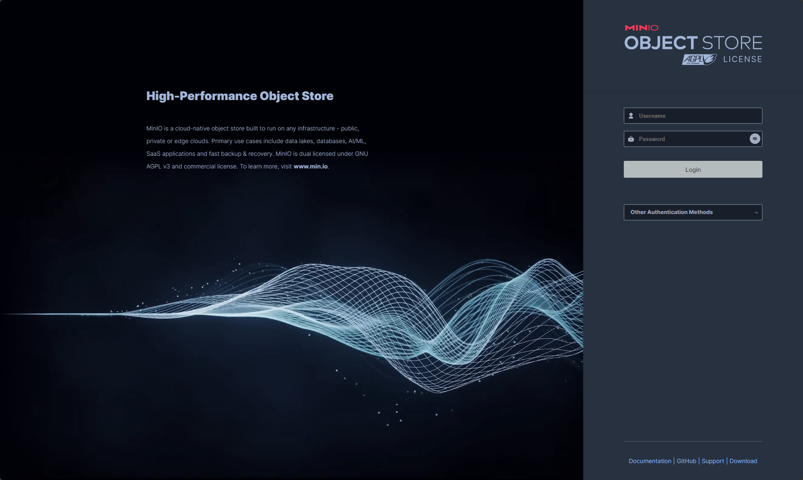
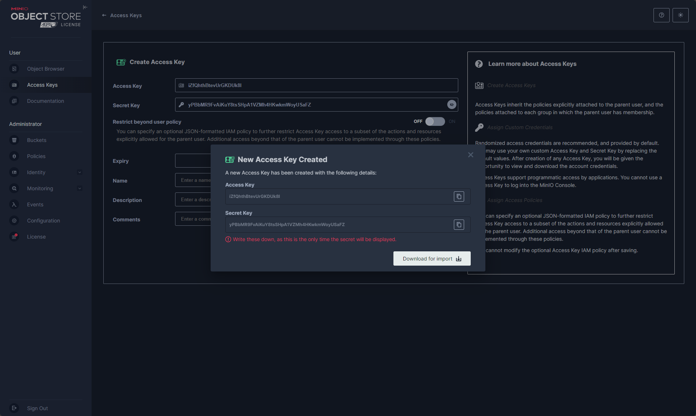

# 🚀 Water Moon Server - 在线选片服务端

**Water Moon Server** 是在线选片系统的后端服务，基于 **NestJS + MySQL** 构建，提供订单管理、照片标记、产品配置、套餐限制、短链访问等完整 API 支持，同时实现了基于角色的权限控制模型（RBAC）。

本项目为 [Water Moon 系列](https://github.com/NightFire0307) 的核心服务端，与 [前台客户端](https://github.com/NightFire0307/water-moon-client) 和 [后台管理端](https://github.com/NightFire0307/water-moon-admin) 一同组成完整的影楼在线选片解决方案。

---

## ✨ 功能特性（Features）

- 📁 **订单管理**：创建订单、绑定照片集、设置可选产品及套餐
- 🖼️ **照片集管理**：上传原片、预览、分类、标记产品用途（如大框、相册等）
- 🛠️ **产品配置**：支持产品类型维护及每类产品张数限制
- 🎁 **套餐系统**：支持按套餐组合产品并配置是否允许超出照片数量
- 🔗 **短链访问**：每个订单生成独立选片链接 + 动态访问密码
- 🔐 **权限控制（RBAC）**：管理员 / 选片师 / 普通用户三种角色，权限分明
- 🧾 **选片结果提交**：保存用户选择的照片、备注，供后期导出使用

---

## ⚙️ 技术栈（Technology Stack）

- 🖥️ 框架：[NestJS](https://nestjs.com/) + [TypeORM](https://typeorm.io/)
- 🗄️ 数据库：MySQL
- ☁️ 文件存储：MinIO / OSS（支持客户端直传）
- 🔐 权限控制：JWT + RBAC 权限模型
- 🧰 构建部署：Docker + PM2（推荐生产环境使用）

---

## 📦 安装与运行（Installation）

### 克隆项目

```bash
git clone https://github.com/NightFire0307/water-moon-server.git
cd water-moon-server

# 安装依赖
npm i

# 启动服务
npm run start:dev

# 初始化数据库数据
npm run seed

```

### Minio 安装

```bash
docker pull minio/minio

docker run -d \
  --name minio \
  -p 9000:9000 \
  -p 9001:9001 \
  -e "MINIO_ROOT_USER=minioadmin" \
  -e "MINIO_ROOT_PASSWORD=minioadmin" \
  -v /data/minio/data:/data \
  -v /data/minio/config:/root/.minio \
  minio/minio server /data --console-address ":9001"
```

### Minio AK&SK 获取

```bash
username: minioadmin
password: minioadmin
```




6. 复制 AK & SK 到环境配置文件

```BASH
# .env.production || .env.development

# Minio OSS
minio_bucket=bucket名字
minio_endpoint=minio服务器地址
minio_port=minio服务器端口
minio_expire_time=minio生成下载凭据的过期时间
minio_access_key=AK
minio_secret_key=SK
```

## 🤝 参与贡献（Contributing）

我们欢迎任何形式的贡献！无论是提交 bug、提建议、添加功能，还是改进文档，都是对项目的重要支持。
